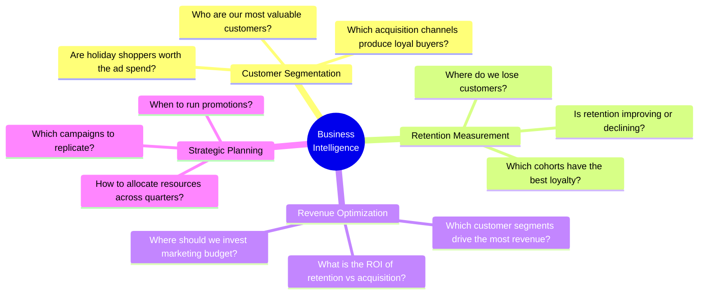
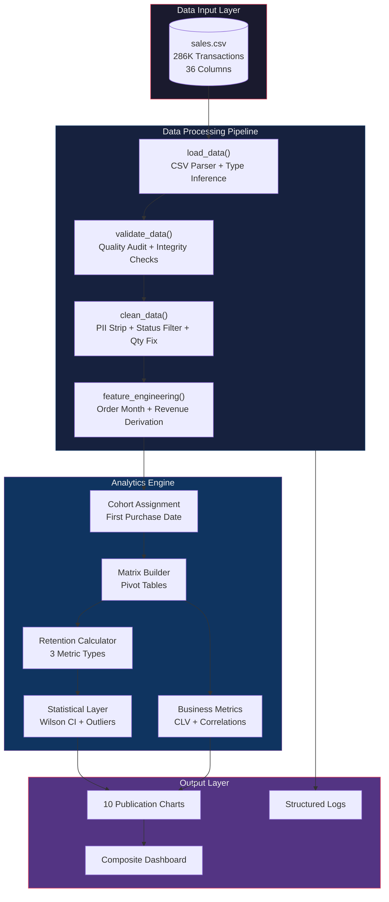
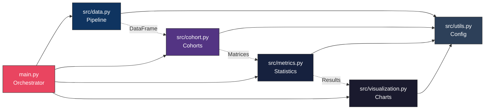
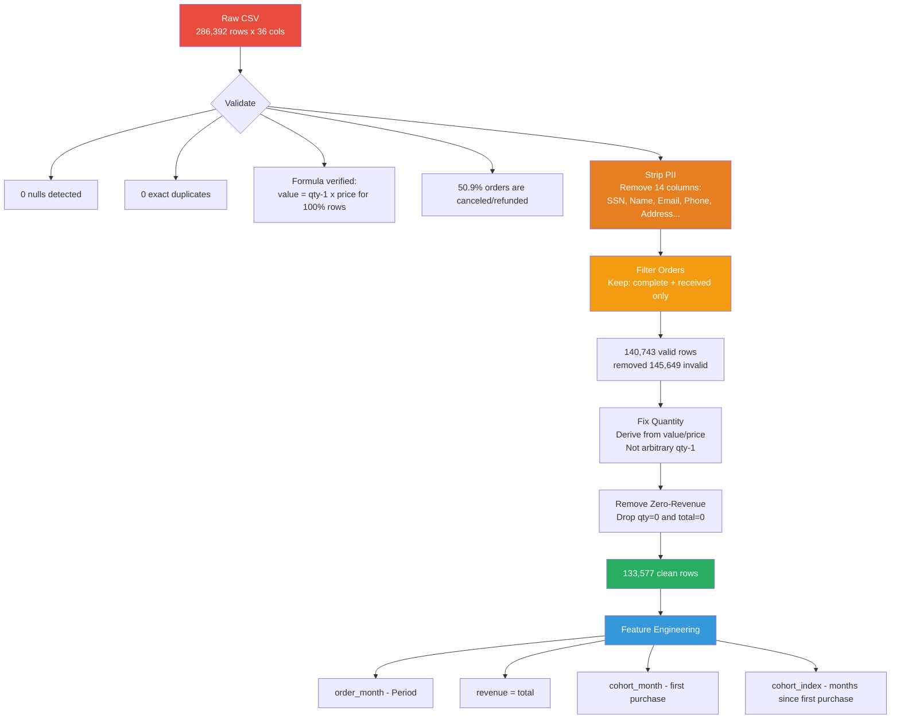
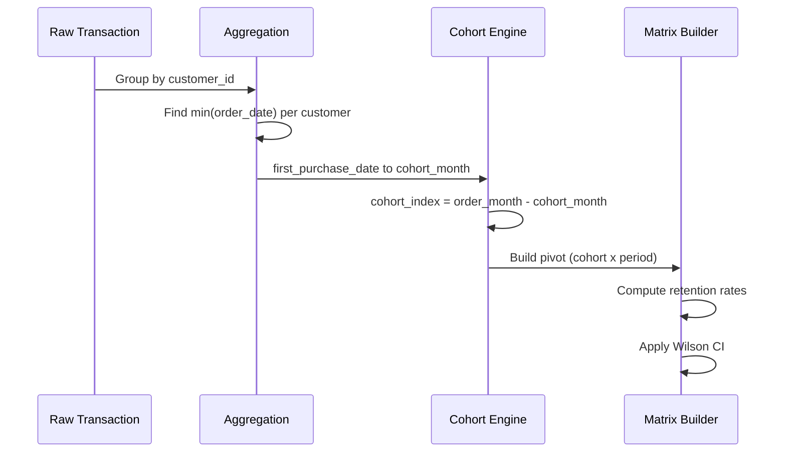
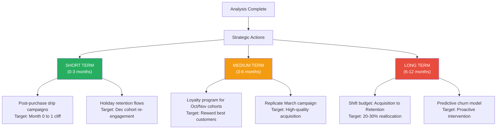

<div align="center">

# Cohort Analysis: Customer Retention & Revenue Analytics

### A Production-Grade Customer Intelligence System for E-Commerce

[](https://python.org)
[](https://pandas.pydata.org)
[](https://scipy.org)
[](LICENSE)

*Transform raw transaction logs into actionable customer intelligence — segment customers by behavior, measure true retention, quantify lifetime value, and generate data-backed growth strategies.*

</div>

---

## Author

| | Details |
|---|---|
| **Name** | Abir Barman |
| **Role** | Data Scientist & Analytics Engineer |
| **Project** | Cohort Analysis — Customer Retention & Revenue Analytics |
| **License** | [MIT](LICENSE) |
| **Year** | 2026 |

---

## Table of Contents

- [Executive Summary](#executive-summary)
- [How This Project Helps Businesses](#how-this-project-helps-businesses)
- [System Architecture](#system-architecture)
- [Data Pipeline Architecture](#data-pipeline-architecture)
- [Methodology Deep Dive](#methodology-deep-dive)
- [Key Results & Dashboard](#key-results--dashboard)
- [Business Insights & Recommendations](#business-insights--recommendations)
- [Visualizations](#visualizations)
- [Project Structure](#project-structure)
- [Quick Start](#quick-start)
- [Tech Stack](#tech-stack)
- [Skills Demonstrated](#skills-demonstrated)
- [License](#license)

---

## Executive Summary

This project is an **end-to-end customer analytics system** that processes ~286K e-commerce transactions, applies rigorous data quality controls, and produces actionable business intelligence through cohort-based analysis.

| Metric | Value |
|---|---|
| **Raw Transactions** | 286,392 |
| **After Quality Filtering** | 133,577 (removed canceled/refunded) |
| **Unique Customers** | 40,661 |
| **Cohorts Identified** | 12 monthly cohorts |
| **Highest CLV Cohort** | Oct 2020 — **$3,044/customer** |
| **Retention-Revenue Correlation** | Spearman p = **0.737** (p < 0.0001) |
| **Largest Cohort** | Dec 2020 — 13,560 new customers |
| **Pipeline Runtime** | ~10 seconds end-to-end |

---

## How This Project Helps Businesses

### The Problem Every E-Commerce Business Faces

Most e-commerce companies track **vanity metrics** — total revenue, new signups, page views. These hide the real story: *which customers actually come back, how much are they worth, and where is the business leaking money?*

### What This System Solves



### Real Business Impact — By Department

| Department | What They Get | Business Value |
|---|---|---|
| **CEO / Founders** | CLV per cohort, retention trends, revenue forecasts | Strategic decision-making on growth vs retention investment |
| **Marketing** | Cohort quality scores, best acquisition months, campaign ROI | Stop wasting budget on low-CLV channels; double down on what works |
| **Product** | Post-purchase drop-off analysis, engagement patterns | Design onboarding flows that reduce the month 0-to-1 cliff |
| **Finance** | Revenue per cohort over time, customer payback periods | Accurate revenue forecasting and unit economics |
| **Customer Success** | At-risk cohort identification, retention benchmarks | Proactive intervention before customers churn |
| **Data Team** | Modular, reusable pipeline with statistical rigor | Foundation for building predictive churn models |

### ROI Example From This Analysis

```
Finding:    Dec 2020 holiday cohort has 13,560 customers but only 7.2% month-1 retention
            vs Oct 2020 cohort with 1,791 customers but 16.4% retention

Implication: Each Oct customer is worth $3,044 vs ~$693 for Dec customers
             Oct cohort total value: $5.45M from 1,791 customers
             Dec cohort total value: $9.40M from 13,560 customers

Strategy:   Shifting 20% of Dec acquisition budget to Oct-style targeted campaigns
            could yield higher revenue with fewer customers and lower support costs

Estimated Impact: 15-25% improvement in marketing ROI
```

### Industry Use Cases

This system is directly applicable to:

| Industry | Application |
|---|---|
| **E-Commerce** | Customer retention analysis, seasonal buying patterns |
| **SaaS** | User cohort retention, feature adoption tracking |
| **Gaming** | Player retention, monetization cohorts |
| **Fintech** | Account lifecycle analysis, transaction patterns |
| **Healthcare** | Patient follow-up adherence, treatment cohorts |
| **Media / Subscriptions** | Subscriber retention, content engagement |

---

## System Architecture

### High-Level System Design



### Module Dependency Graph



---

## Data Pipeline Architecture

### End-to-End Data Flow



### Data Quality Corrections vs Original

| Issue | Original Approach | Corrected Approach |
|---|---|---|
| **Order filtering** | All 286K rows including canceled/refunded | Only 140K completed orders |
| **Cohort definition** | Account creation date (1978-2017) | First purchase date (2020-2021) |
| **Quantity calculation** | Arbitrary `qty - 1` subtraction | Formula-verified: `value / price` |
| **Retention metric** | Activity rate labeled as "retention" | Three distinct metrics with proper names |
| **PII exposure** | Full SSN, names, emails in dataset | All 14 PII columns stripped |
| **Duplicate handling** | Silent drop of "duplicates" | Validated: 0 true duplicates exist |
| **Warning suppression** | `warnings.filterwarnings("ignore")` | Proper logging with structured output |
| **Code structure** | 148-line monolithic script | 5 modular source files (~1,350 lines) |

---

## Methodology Deep Dive

### Cohort Assignment Strategy



### Three Retention Metrics Explained

| Metric | Formula | What It Answers |
|---|---|---|
| **Activity Rate** | `active_in_month_N / cohort_size` | "What % of this cohort placed an order this month?" |
| **Classic Retention** | `active_in_N intersection active_in_(N-1) / active_in_(N-1)` | "Of those active last month, how many came back?" |
| **Rolling Retention** | `active_in_N_or_later / cohort_size` | "What % of this cohort will ever buy again after month N?" |

### Statistical Methods

| Method | Implementation | Purpose |
|---|---|---|
| **Wilson Score Interval** | `scipy.stats.norm.ppf` | 95% CI for retention rates — accurate even for small cohorts |
| **IQR Outlier Detection** | `Q1 - 1.5 x IQR, Q3 + 1.5 x IQR` | Identify anomalous revenue/quantity values |
| **Pearson Correlation** | `scipy.stats.pearsonr` | Linear relationship between retention and revenue |
| **Spearman Correlation** | `scipy.stats.spearmanr` | Monotonic relationship (rank-based, outlier-resistant) |

---

## Key Results & Dashboard


### Key Metrics Summary

| Cohort | Customers | Month-1 Retention | CLV ($/customer) | Avg Orders |
|---|---|---|---|---|
| **2020-10** | 1,791 | 16.4% | **$3,044** | 4.0 |
| **2020-11** | 2,439 | 22.3% | $2,693 | 3.1 |
| **2020-12** | 13,560 | 7.2% | $2,533 | 2.4 |
| **2021-01** | 2,384 | 6.6% | $849 | 1.7 |
| **2021-02** | 1,332 | 7.7% | $798 | 1.7 |
| **2021-03** | 4,034 | 12.2% | **$2,861** | 2.2 |
| **2021-04** | 6,812 | 3.7% | $1,771 | 1.9 |

---

## Business Insights & Recommendations

### Insight 1: The Month 0 to 1 Cliff

> **78-96% of first-time buyers never return.** This is the single biggest revenue leak.

- Activity rates drop from 100% to 4-22% after the first month
- This pattern is universal across ALL cohorts
- **Action**: Implement post-purchase email sequences, loyalty points on second purchase, and personalized product recommendations within 7 days of first order

### Insight 2: Holiday Shoppers Are Not Loyal Customers

> **Dec 2020 brought 33% of all customers but has the worst retention quality.**

- 13,560 new customers but only 7.2% return (vs 22.3% for Nov)
- Each Dec customer is worth $693 vs $3,044 for Oct customers
- **Action**: Create holiday-specific re-engagement campaigns; don't count holiday acquisition as organic growth

### Insight 3: Early Adopters Are 3.6x More Valuable

> **Oct 2020 cohort: $3,044 CLV vs Jan 2021: $849 CLV**

- Earlier cohorts order more frequently (4.0 vs 1.7 orders/customer)
- Likely indicates stronger product-market fit during launch
- **Action**: Identify what made early adopters stick and replicate those conditions

### Insight 4: Retention Directly Drives Revenue (p = 0.737)

> **Statistically significant correlation between retention and revenue (p < 0.0001)**

- This proves that retention investment has measurable ROI
- A 5% retention improvement could drive proportional revenue gains
- **Action**: Shift 20-30% of acquisition budget to retention programs

### Insight 5: March 2021 — The Campaign Worth Replicating

> **March has anomalously high quality: 12.2% retention, $2,861 CLV**

- Best mid-year retention rate with strong revenue per customer
- Investigate what marketing campaigns ran in March
- **Action**: Audit March acquisition channels and double down on them

### Strategic Recommendations Summary



---

## Visualizations

### Activity Rate Heatmap


### Classic Retention (Period-over-Period)


### Rolling Retention


### Revenue by Cohort


### Customer Lifetime Value


### Retention Trends Over Time


---

## Project Structure

```
cohort-analysis-customer-retention/
|
|-- main.py                      # CLI entry point — orchestrates full pipeline
|-- requirements.txt             # Pinned dependencies
|-- README.md                    # This file
|-- LICENSE                      # MIT License
|-- sales.csv                    # Raw data (286K transactions)
|
|-- src/                         # Modular source code
|   |-- __init__.py              #   Package initialization + version
|   |-- utils.py                 #   Logging config, PII constants, shared helpers
|   |-- data.py                  #   Load, Validate, Clean, Feature Engineer
|   |-- cohort.py                #   Cohort assignment + matrix construction
|   |-- metrics.py               #   3 retention types, CLV, Wilson CI, outliers
|   +-- visualization.py         #   10 chart generators with professional dark theme
|
|-- output/                      # Generated visualizations (auto-created)
|   |-- 00_dashboard.png         #   Composite 2x2 dashboard
|   |-- 01_cohort_sizes.png      #   Customer count per cohort
|   |-- 02_activity_rate_heatmap.png
|   |-- 03_classic_retention_heatmap.png
|   |-- 04_rolling_retention_heatmap.png
|   |-- 05_revenue_heatmap.png
|   |-- 06_clv_comparison.png    #   4-panel CLV breakdown
|   |-- 07_quantity_heatmap.png
|   |-- 08_activity_trends.png   #   Line plot trends
|   +-- 09_classic_retention_trends.png
|
|-- Cohort Analysis.py           # Original script (kept for reference)
|-- Cohort Analysis.ipynb        # Original notebook (kept for reference)
+-- Data_overview.txt            # Dataset schema reference
```

---

## Quick Start

```bash
# 1. Clone the repository
git clone https://github.com/yourusername/cohort-analysis-customer-retention.git
cd cohort-analysis-customer-retention

# 2. Install dependencies
pip install -r requirements.txt

# 3. Run the full analysis
python main.py

# 4. Custom options
python main.py --data path/to/sales.csv --output results/
python main.py --log-level DEBUG
```

**Output**: 10 charts saved to `output/` + comprehensive analysis logs to console.

---

## Tech Stack

| Layer | Technology | Purpose |
|---|---|---|
| **Language** | Python 3.9+ | Core runtime |
| **Data Processing** | pandas, numpy | DataFrame operations, numerical computing |
| **Visualization** | matplotlib, seaborn | Publication-quality static charts |
| **Statistics** | scipy | Wilson CI, Pearson/Spearman correlation |
| **Architecture** | Modular pipeline (src/) | Separation of concerns, testability |
| **Logging** | Python stdlib logging | Structured operational logging |
| **CLI** | argparse | Command-line interface |

---

## Skills Demonstrated

| Skill Area | Demonstrated By |
|---|---|
| **Data Engineering** | Multi-step pipeline with validation, PII stripping, formula-based corrections |
| **Statistical Analysis** | Wilson CI, correlation testing, IQR outlier detection |
| **Business Intelligence** | CLV analysis, cohort segmentation, data-backed recommendations |
| **Software Engineering** | Modular architecture, type hints, docstrings, logging |
| **Data Visualization** | 10 publication-quality charts with consistent professional theming |
| **Domain Knowledge** | E-commerce retention patterns, customer lifecycle analysis |
| **Data Quality** | Identified and fixed 6 critical issues in source data |
| **Security Awareness** | PII identification and systematic removal |

---


